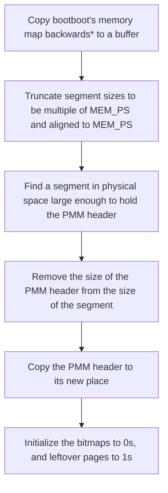
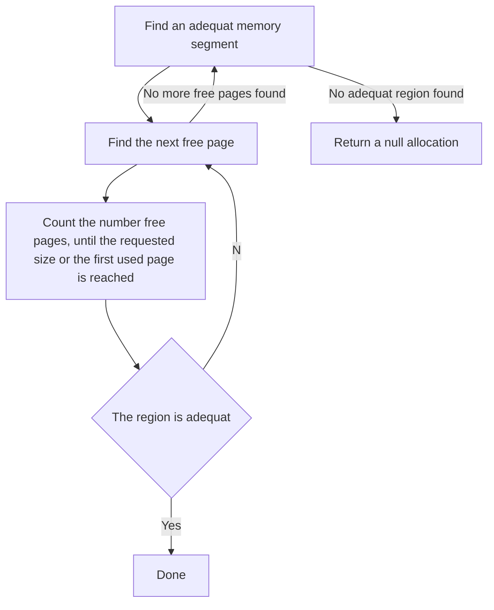

# Overview
One of the most fundamental jobs of the operating system is managing memory.
In x86, memory management has multiple layers. To manage memory, an operating
system needs to manage each one of those layers. This documentation contains
information on how HeliumOS deals with memory. The implementation is very messy,
and if it wasn't because I am already sick of this topic, I would have rewritten
everything, again.

# Index
- [Overview](#overview)
- [Index](#index)
- [Physical memory manager](#physical-memory-manager)
  - [Features](#features)
  - [Concepts](#concepts)
    - [Memory segment](#memory-segment)
    - [Memory region](#memory-region)
    - [PMM header](#pmm-header)
    - [Segment header](#segment-header)
  - [Algorithms](#algorithms)
    - [Initialization](#initialization)
    - [Allocation](#allocation)
    - [Deallocation](#deallocation)
  - [Interface](#interface)
- [Virtual memory manager](#virtual-memory-manager)
  - [Virtual memory layout](#virtual-memory-layout)
    - [Kernel space layout](#kernel-space-layout)
    - [User space layout](#user-space-layout)
  - [Concepts](#concepts-1)
    - [VCache](#vcache)
      - [Purpose](#purpose)
      - [Features](#features-1)
      - [Interface](#interface-1)
    - [Virtual memory mapper](#virtual-memory-mapper)
      - [Features](#features-2)
      - [Interface](#interface-2)
- [Kernel Heap](#kernel-heap)
  - [Features](#features-3)
  - [Interface](#interface-3)

# Physical memory manager
## Features
* Allocate regions from physical address space, with a size hint
* Free regions of the physical address space previously allocated
* Prefer higher addresses when no constraints are forced
* Support constraints:
  * Continuous region(Treat size as a must, not a hint)
  * Maximum address(The region should be below a certain address)

## Concepts
### Memory segment
A continuous range of addresses that point to valid RAM space, can be
represented with a starting address and a size. Multiple allocations can be on
the same segment.

### Memory region
A part of a memory segment that represents a single allocation.

### PMM header
The physical memory manager uses a header to keep track of different regions.
The header is an array of variable sized elements(The size is a multiple of 8
bytes), each element is referred to as a segment header.

### Segment header
The segment header consists of a small subheader containing a pointer to the
memory area managed by that segment, and the size of the segment, followed by a
bitmap where each bit represents the availability state of a [mem.h]:MEM_PS
sized page.

## Algorithms
### Initialization

*: Copy the map backwards to make the algorithm prefer higher addresses when not
constrained
### Allocation

### Deallocation
Deallocation is as simple as clearing the bits pointed to by the allocation
structure.

## Interface
* struct mem_pallocation { header_off, padr, size }
* func mem_ppaloc(pheader, size, continuous : bool, below : ptr) ->
  mem_pallocation
* func mem_ppfree(pheader, alloc : mem_pallocation) : void
* func mem_init() : void
* file [mem.h]
* file [mem.c]
* file [pmem.c]
* file [internal_mem.h]

# Virtual memory manager
## Virtual memory layout
In general, the memory layout HeliumOS uses is as follows:

| Start        | End          | Size         | Description         |
| ------------ | ------------ | ------------ | ------------------- |
| 0            | 128T         | 128T         | User space memory   |
| 128T         | 15E1023P896T | 15E1023P768T | invalid addresses   |
| 15E1023P896T | 16E          | 128T         | Kernel space memory |

### Kernel space layout
| Start*   | End*     | Size       | Description              |
| -------- | -------- | ---------- | ------------------------ |
| 0        | 8M       | 8M         | Vcache memory            |
| 8M       | 256G     | 255G1016M  | Undefined                |
| 256G     | 512G     | 256G       | Physical memory header   |
| 512G     | 1T       | 512G       | Kernel Heap              |
| 1T       | 1T512G   | 512G       | initrd                   |
| 1T512G   | 1T512G4K | 4K         | LAPIC registers          |
| 1T512G4K | 1T513G   | 1023M1024K | Undefined                |
| 1T513G   | 1T768G   | 255G       | IOAPIC control registers |
| 1T768G   | 2T       | 256G       | ACPI Tables              |
| 2T       | 4T       | 2T         | Processor table          |
| 4T       | 112T     | 108T       | Undefined                |
| 112T     | 128T     | 16T        | Bootboot reserved        |

*Addresses are offseted, the real addresses can be calculated by adding
15E1023P896T to the addresses in the table*

### User space layout
| Start | End  | Size  | Description                                      |
| ----- | ---- | ----- | ------------------------------------------------ |
| 0     | 2G   | 2G    | Invalid                                          |
| 2G    | 1T   | 1022G | Main executable image                            |
| 1T    | 16T  | 15T   | Invalid                                          |
| 16T   | 17T  | 1T    | Stack(Only 2M is allocated, the rest is invalid) |
| 17T   | 128T | 111T  | Undefined                                        |

## Concepts
The virtual memory manager comes with 2 subsystems, the VCache, and the global
virtual memory mapper.

### VCache
#### Purpose
When implementing the global virtual memory mapper, I found myself already
needing a way to map memory into virtual space. I needed the virtual memory
mapper to implement one. The solution I chose was to make the VCache system,
which is a mini virtual memory mapper, and it gets around the problem of needing
a virtual memory mapper itself by having limited size and predetermined virtual
memory structure addresses already mapped at initialization.

#### Features
* Provide 4K pages quickly
* Remember pages that were just deallocated to use them again

#### Interface
The interface of VCache is only visible to the memory management subsystem, not
the rest of the kernel nor user space.
* struct vcache_unit { ptr, pde, pte }
* func vcache_map(padr) -> vcache_unit
* func vcache_remap(unit, padr)
* func vcache_umap(unit, id)

### Virtual memory mapper
#### Features
* Map a region from virtual address space to a region from physical address
  space
* Unmap a region from virtual address space
* Set permissions on a maping
* Support 4K, 2M and 1G page sizes

#### Interface
* func mem_vmap(vadr, padr, size, flags)
* func mem_vumap(vadr, size)
* flag MAPF_R
* flag MAPF_W
* flag MAPF_X
* flag MAPF_U
* flag MAPF_P2M
* flag MAPF_P1G
* flag MAPF_G

# Kernel Heap
On top of the physical and virtual memory manager, HeliumOS also implements
kernel space heap. This API is not exposed to the user space programs which
must implement their heaps on their own.

## Features
* mimic libc's malloc, calloc, realloc, reallocarray, & free

## Interface
* func malloc(size)
* func calloc(n, msize)
* func realloc(ptr, size)
* func reallocarray(ptr, n, msize)
* func free(ptr)

[mem.h]: ../kernel/include/mem.h
[mem.c]: ../kernel/src/mem/mem.c
[pmem.c]: ../kernel/src/mem/pmem.c
[internal_mem.h]: ../kernel/src/mem/internal_mem.h
