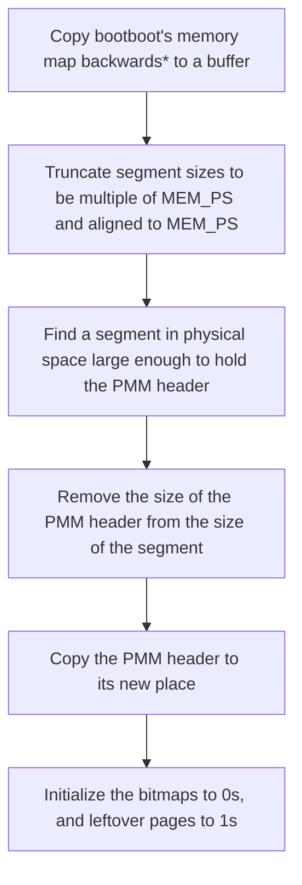
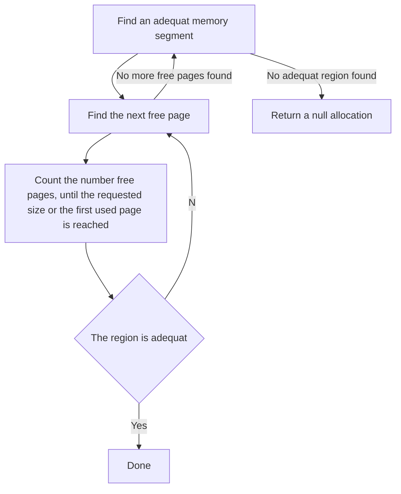

# Physical memory manager
## Features
* Allocate regions from physical address space, with a size hint
* Free regions of the physical address space previously allocated
* Prefer higher addresses when no constraints are forced
* Support constraints:
  * Continuous region(Treat size as a must, not a hint)
  * Maximum address(The region should be below a certain address)

## Concepts
### Memory segment
A continuous range of addresses that point to valid RAM space, can be
represented with a starting address and a size. Multiple allocations can be on
the same segment.

### Memory region
A part of a memory segment that represents a single allocation.

### PMM header
The physical memory manager uses a header to keep track of different regions.
The header is an array of variable sized elements(The size is a multiple of 8
bytes), each element is referred to as a segment header.

### Segment header
The segment header consists of a small subheader containing a pointer to the
memory area managed by that segment, and the size of the segment, followed by a
bitmap where each bit represents the availability state of a [mem.h]:MEM_PS
sized page.

## Algorithms
### Initialization

*: Copy the map backwards to make the algorithm prefer higher addresses when not
constrained
### Allocation

### Deallocation
Deallocation is as simple as clearing the bits pointed to by the allocation
structure.

## Interface
* struct mem_pallocation { header_off, padr, size }
* func mem_ppaloc(pheader, size, continuous : bool, below : ptr) :
  mem_pallocation
* func mem_ppfree(pheader, alloc : mem_pallocation) : void
* func mem_init() : void
* file [mem.h]
* file [mem.c]
* file [pmem.c]
* file [internal_mem.h]

# Virtual memory manager (WIP)
## Features
* Map a region from virtual address space to a region from physical address
  space
* Unmap a region from virtual address space
* Set permissions on a maping
* Support 4K, 2M and 1G page sizes

## Concepts
### VMM header
Not implemented yet.

## Implementation
Not implemented yet.

## Interface
Not implemented yet.

## WIP
The layout of the virtual address space is as follows(Values wrap at the limit
of 64 bit signed integers):
- [0;128T) (128T): User space memory; Undefined as of yet
- [128T;-128T) (16MT): Non canonical addresses; Non existent as we use 48bit
  addresses
- [-128T;0) (128T): Kernel space: Details follow

Kernel space structure(We take 0 the relative origin to be the absolute -128T
address):
- [0;16T) (16T): VMM domain; Details follow
- [16T;32T) (16T): Kernel heap
- [32T;112T) (80T): Reserved; May(will) be used in future versions
- [112; 128T) (16T): Bootboot reserved(we don't touch that)

VMM domain structure(We take 0 the relative origin to the absolute -128T
address):
- [0;2M) (2M): VCache pages
- [2M;15T) (15T-2M): Reserved
- [15T;16T) (1T): Virtual bookeeping super structure (only the last 513G2M4K is
  used)

[mem.h]: ../kernel/include/mem.h
[mem.c]: ../kernel/src/mem/mem.c
[pmem.c]: ../kernel/src/mem/pmem.c
[internal_mem.h]: ../kernel/src/mem/internal_mem.h
